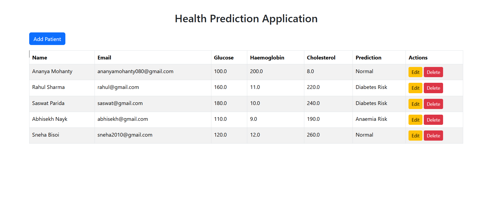
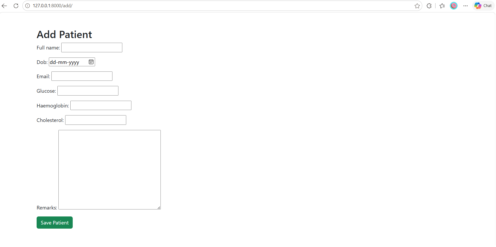
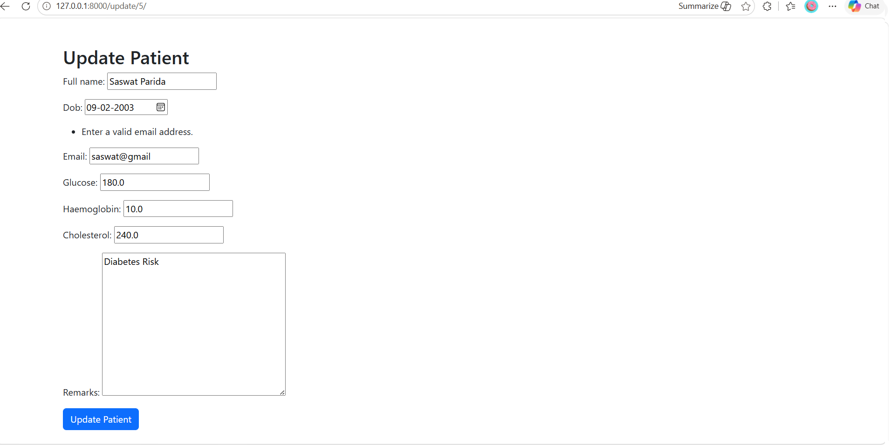

# health-prediction-django-ai

AI-powered Health Prediction Application developed using Django, SQLite, and Scikit-learn with CRUD operations, validation, and machine learning-based health risk prediction.

## Features

- Add Patient
- Update Patient
- Delete Patient
- Health Risk Prediction using Machine Learning
- Email Validation
- Future DOB Validation
- SQLite Database
- Django Framework

## Screenshots

### Home Page

### Add Patient

### Prediction Result

